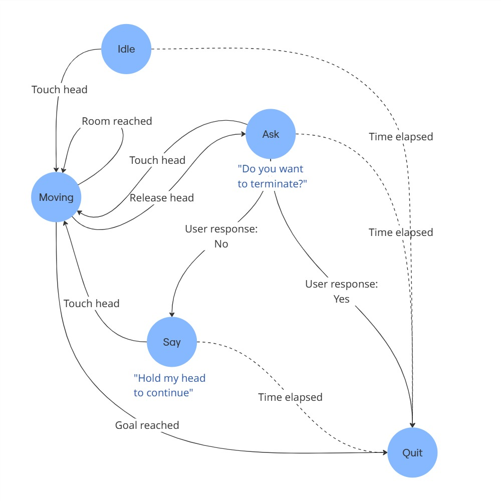

# Pepper Walking Assistant

This project enables Pepper to help users — both with and without disabilities — navigate through a building or facility. The system uses a set of pre-defined locations and a combination of voice and visual cues to guide the user. The entire codebase runs within a Docker container. 

Main features are:
- User profiling with non invasive questioning.
- Assisting users navigating complex environments using voice and visual cues.
- Customized support for different buildings and environments enabled by simply defining a graph-like structure.
- Use of a finite state automata to define the behavior of the robot; this enables us to easily add new actions and perform new tasks during user interaction.

The process is divided into two phases: 
- The user approaches the robot and asks for help to reach a place through the tablet or verbally. The robot automatically wakes up if someone stands in front of it; 
- Once we established language, target destination and eventual disability, a motion script is launched to compute the optimal path to the destination, avoiding architectural barriers if needed, and perform the actual motion that will lead the user safely to the goal.

## Examples

TODO

## Finite state automata

Whenever the robot has to guide a user from the current position to a target destination, the motion script is launched.
We used a finite state automata to define the robot's behavior during this phase:



More on the states:
- **Idle**: The robot instructs the user to hold its head. It then waits for user interaction. If the maximum wait time elapses without interaction, the automaton goes into the **Quit** state and the procedure is aborted.  

- **Moving**: Once the user holds the robot's head, it starts moving towards the destination.  
  - If the user releases the head, the system transitions to the **Ask** state.  
  - If the destination is reached, the system transitions to the **Quit** state.  
  - When moving, the automaton uses the Motion Manager Module to get the current target (next node to be reached) and the Action Manager Module to actually implement the motion.  
  - Once it reaches a node, if it is not the last of the path, it transitions again into the **Moving** state with a different target.  
  - To account for momentary loss of contact, a timer is started upon entering this state, based on the expected movement duration. If interrupted, the timer is halted, preserving the remaining movement time for when the state is re-entered.  

- **Ask**: This state is triggered if the user releases the robot’s head during movement.  
  - The robot asks whether the user wants to cancel the navigation.  
  - The user may respond **"No"** or re-establish contact to resume, or respond **"Yes"** to confirm cancellation.  
  - If the maximum wait time elapses without a response, the system transitions to the **Quit** state.  
  - For users with hearing impairments, instructions are also provided through the tablet.  

- **Say Hold Head**: If, in the **Ask** state, the user responds **"No"** but does not re-establish contact, the robot reminds them to hold its head via a visual message (on the tablet) or a verbal prompt.  
  - The system then transitions back to the **Moving** state, resuming motion.  
  - If no response is given after the robot repeats the instructions, the system transitions to the **Quit** state.  

- **Quit**: The system releases all allocated resources and terminates the guiding process.


## Map


- The map is processed as a graph, where each node represents a room or location of interest, and each edge represents a traversable path. Each edge includes information about the cost (time required) and accessibility level. The accessibility level classifies edges based on their suitability for users with mobility or visual impairments. Specifically:  
  - **Level 0**: The edge is free of architectural barriers and can be traversed by all users.  
  - **Level 1**: The edge presents obstacles that hinder navigation for individuals with mobility or vision impairments. Such edges should be excluded from the motion planning process when guiding users who require accessible paths.  

- During the path planning stage, once the user is identified and their preferred interaction modality is determined, the system infers the appropriate accessibility level for route computation:  
  - **Visually impaired users**: The system prioritizes auditory guidance and ensures that navigation paths exclude edges classified as Level 0, selecting only those at Level 1 to guarantee ease of traversal.  
  - **Auditory impaired users**: The system includes both Level 0 and Level 1 edges in the path computation, as architectural barriers do not pose a significant challenge.  

- An example of the graph is illustrated in the following image. Suppose the starting point is the Lobby, and the destination is the Office:  
  - If no mobility limitations are present, the shortest path allows direct traversal of the corresponding edge, leading straight to the destination.  
  - For users with mobility impairments, the algorithm instead directs them through the Cafe before reaching the Office (**Figure \ref{fig:map_example_traversal.jpg}**).  
  - This scenario directly reflects the physical constraints that informed the graph structure. For instance, if the Office is located on the second floor and connected to the Lobby by a staircase, users with mobility impairments cannot traverse it. As a result, the algorithm guides them through the Cafe, where an elevator may be available to facilitate access to the upper level.  


## Installation and usage

Note: We assume that you have already completed the setup by following the instructions in the [Docker image's repository](https://bitbucket.org/iocchi/hri_software/src/7ee6a9cdb3c3d3ebf437b52c2f1ab42050aa829e/docker/).

<!--
Show all the containers:

```bash
docker ps -a
```
-->

### Docker

1. **Run docker**
    
    Run the last version of docker:
    ```bash
    cd <hri_software>/docker
    ./run.bash
    ```

    Or run a specific version:
    ```bash
    cd <hri_software>/docker
    ./run.bash [<version>]
    ```
2. **Access the container**

    In another terminal:
    ```
    docker exec -it pepperhri tmux a
    ```

    This will launch a tmux session with a tab for each program you might need to communicate with a Pepper robot both in real life and simulation.
    The tmux session makes it easy to start the servers.

    From the naoqi tab:
    ```bash
    ./naoqi
    ```
    
    From the choregraphe tab:
    ```bash
    ./choregraphe
    ```
   
### Clone the repo

1. **Place the code in the `playground` directory**.

    This will make it persistent between sessions.
    ```bash
    git clone https://github.com/BrunoIannone/Pepper-Walking-Assistant.git <playground>/Pepper-Walking-Assistant
    cd <playground>/Pepper-Walking-Assistant
    ```

### MODIM

1. **Start Nginx**

    Outside of Docker, run the following command from the `hri_software/docker` directory:
    ```bash
    ./run_nginx.bash <playground>/Pepper-Walking-Assistant/demo/
    ```
   
    Note: You should kill manually Nginx after you're done.
    ```bash
    sudo killall nginx
    ```

2. **Start the MODIM Server**

    Start the MODIM server from the `modim` tab in the tmux session:
    ```bash
    python ws_server.py -robot pepper
    ```

3. **Access the Browser**

    Open a browser and go to [localhost](http://localhost).

### Run the script

1. **Start the application**
   
   To start the application, run the python script from the `playground` tab in the tmux session:
    ```bash
    # Example: accessibility level=1 (no stairs) user id=0
    python2 demo/scripts/main.py --uid 0
    ```
   
    User recognition, automatic speech recognition and motion are unavailable in simulation. We need to give to the robot
    the user id manually.

2. **Interact with the robot** 

   During the simulation we can interact with the robot with the `touch_sim` script to simulate the left/right hand touch.
   Run this command from the `pepper_tools` tab in the tmux session: 
   ```bash
   # Example: keep touching the left hand for 20 seconds
   python2 <pepper_tools>/touch/touch_sim.py --sensor LHand --duration 20
   ```

   ```bash
   python2 <pepper_tools>/asr/human_say.py --sentence "Yes"
   ```
   