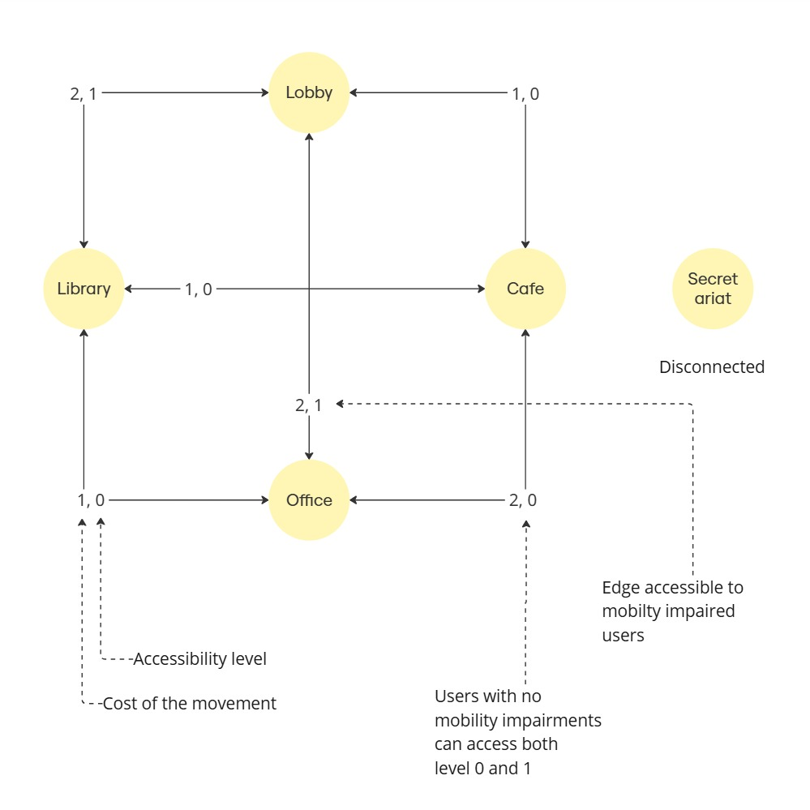

# Pepper Walking Assistant

This project enables Pepper to help users — both with and without disabilities — navigate through a building or facility. The system uses a set of pre-defined locations and a combination of voice and visual cues to guide the user efficiently. The entire codebase runs within a Docker container. 

Main features are:
- Assist users with navigation using voice and visual cues.
- Can be customized to support different buildings and environments by simply defining a graph-like structure.
- Can be customized to use different languages by defining the set of sentences the robot will use during interaction.
- The use of an automata to define the behavior of the robot lets us easily add new actions and perform new tasks during user interaction.

The process is divided into two phases: during the first phase the user approaches the robot and asks for help to reach a place through the tablet or verbally; the robot automatically wakes up if someone stands in front of it; during the second phase, once we established the language, target destination, eventual disability and architectural barriers to avoid, we launch the motion script to compute the path to the destination and perform the actual motion that will lead the user safely to the goal.

## Examples

TODO

## Finite state automata

Whenever the robot has to guide a user from the current position to a target destination, the motion script is launched.
We used a finite state automata to define the robot's behavior during this phase:


More on the states:
- `Idle` state: the robot says to the user to hold its left/right hand (depending on the direction for the target room) and waits for user interaction; if the maximum wait time elapses without an interaction, the script terminates;
- `Moving` state: once the user is holding the robot's hand, the robot moves towards the destination. If the user releases the hand, we move to the `Ask` state. If we actually reach the goal, we move into the `Quit` state;
- `Ask` state: we reach this state if, during movement, the user leaves the hand of the robot. In this case the robot asks to the user if they really wants to cancel the procedure. The user can respond "No" or touch the hand again to resume or say "Yes" to confirm. If the maximum wait time elapses and the robot does not register a response, we move into the `Quit` state. If the user is deaf or has some kind of hearing impairment, all the interactions happen through the tablet;
- `Say hold hand` state: if in the `Ask` state the user responds "No" to the question without touching the hand, the robot reminds him to touch the hand with a visual(on the tablet) or vocal message and we move into the `Moving` state again, resuming the motion;  
- `Quit` state: release all the resources we allocated; 

## Map

The map we included for demonstration purposes is the following:



Each edge shows two weights: distance and accessibility level. At runtime we filter out the edges with accessibility level above the selected one to leave only the paths the user can safely go through and we find the shortest path to the goal with the A* algorithm.
We provided only two accessibility levels for now: 0 for motor disabilities or blindness, conditions that prevent the user from using stairs, and 1 for the other cases where architectural barriers are not a problem (e.g. deafness).

Out of simplicity, we suppose all the rooms are arranged on a straight line in order to take out eventual rotations. 

## Installation and usage

Note: We assume that you have already completed the setup by following the instructions in the [Docker image's repository](https://bitbucket.org/iocchi/hri_software/src/7ee6a9cdb3c3d3ebf437b52c2f1ab42050aa829e/docker/).

<!--
Show all the containers:

```bash
docker ps -a
```
-->

### Docker

1. **Run docker**
    
    Run the last version of docker:
    ```bash
    cd <hri_software>/docker
    ./run.bash
    ```

    Or run a specific version:
    ```bash
    cd <hri_software>/docker
    ./run.bash [<version>]
    ```
2. **Access the container**

    In another terminal:
    ```bash
    docker exec -it pepperhri tmux a
    ```

    This will launch a tmux session with a tab for each program you might need to communicate with a Pepper robot both in real life and simulation.
    The tmux session makes it easy to start the servers.

    From the naoqi tab:
    ```bash
    ./naoqi
    ```
    
    From the choregraphe tab:
    ```bash
    ./choregraphe
    ```
   
### Clone the repo

1. **Place the code in the `playground` directory**.

    This will make it persistent between sessions.
    ```bash
    git clone https://github.com/BrunoIannone/Pepper-Walking-Assistant.git <playground>/Pepper-Walking-Assistant
    cd <playground>/Pepper-Walking-Assistant
    ```

### MODIM

1. **Start Nginx**

    Outside of Docker, run the following command from the `hri_software/docker` directory:
    ```bash
    ./run_nginx.bash $HOME/playground/Pepper-Walking-Assistant/demo/
    ```
   
    Note: You should kill manually Nginx after you're done.
    ```bash
    sudo killall nginx
    ```

2. **Start the MODIM Server**

    Start the MODIM server from the `modim` tab in the tmux session:
    ```bash
    python ws_server.py -robot pepper
    ```

3. **Access the Browser**

    Open a browser and go to [localhost](http://localhost).

### Run the script

1. **Start the application**
   
   To start the application, run the python script from the `playground` tab in the tmux session:
    ```bash
    # Example: accessibility level=1 (no stairs) user id=0
    python2 demo/scripts/main.py --uid 0
    ```
   
    User recognition, automatic speech recognition and motion are unavailable in simulation. We need to give to the robot
    the user id manually.

2. **Interact with the robot** 

   During the simulation we can interact with the robot with the `touch_sim` script to simulate the left/right hand touch.
   Run this command from the `pepper_tools` tab in the tmux session: 
   ```bash
   # Example: keep touching the left hand for 20 seconds
   python2 <pepper_tools>/touch/touch_sim.py --sensor LHand --duration 20
   ```

   ```bash
   python2 <pepper_tools>/asr/human_say.py --sentence "Yes"
   ```
   